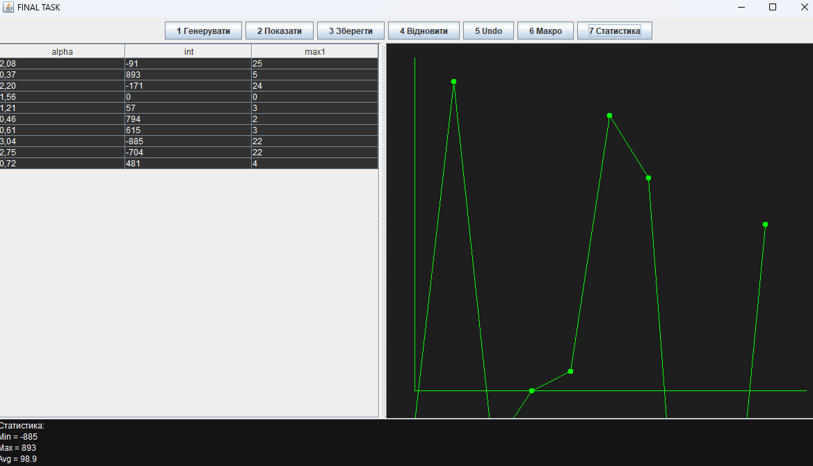

# Завдання на 5 балів

## Вам потрібно виконати наступне: 
- Розробити ієрархію класів відповідно до шаблону Observer (java) та продемонструвати можливість обслуговування розробленої раніше колекції (об'єкт, що спостерігається, Observable) різними (не менше двох) спостерігачами (Observers) – відстеження змін, упорядкування, висновок, відображення і т.д.
- При реалізації ієрархії класів використати інструкції (Annotation). Відзначити особливості різних політик утримання анотацій (annotation retention policies). Продемонструвати підтримку класів концепції рефлексії (Reflection).
- Використовуючи раніше створені класи, розробити додаток, що відображає результати обробки колекції об'єктів у графічному вигляді
- Забезпечити діалоговий інтерфейс з користувачем та перемальовування графіка під час зміни значень елементів колекції.
- ***Виконати індивідуальне завдання згідно номеру в списку:***
- ***6. Визначити найбільшу довжину послідовності 1 в подвійному поданні
цілісної суми квадрата і куба 10 cos(α).***

## Результат: 

## Код мого завдання: 
- [Код](../src/FinalTask.java)