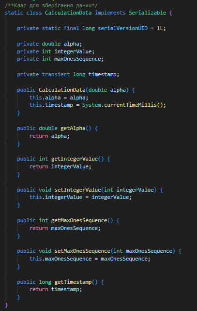
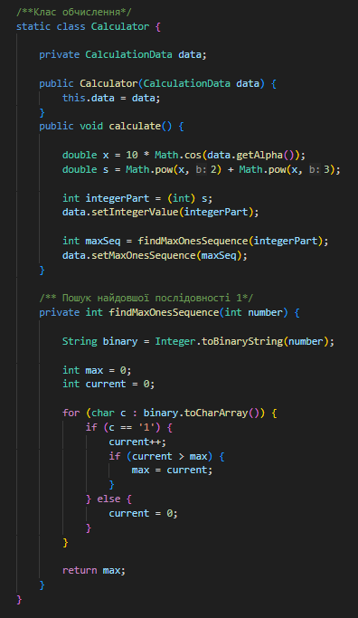
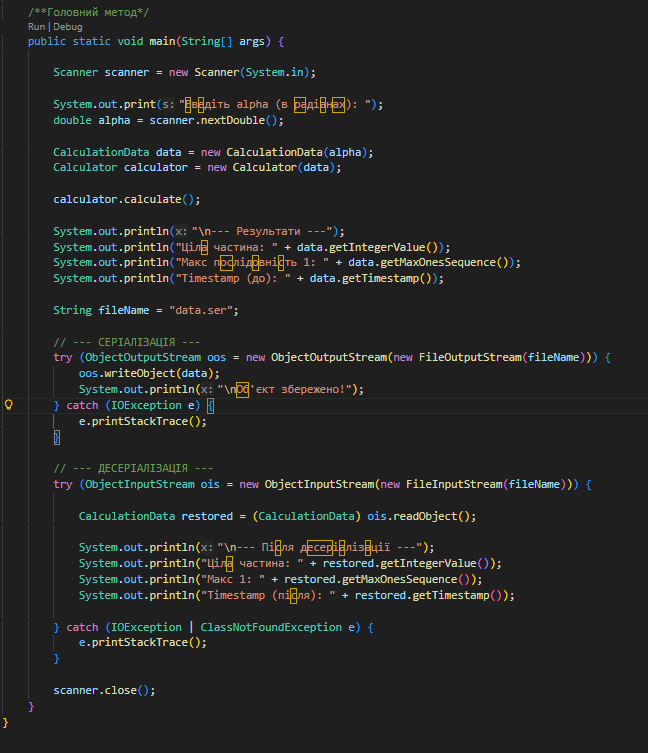
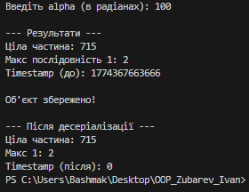

# Завдання 2

## Вам потрібно виконати наступне: 
- Розробити клас, що серіалізується, для зберігання параметрів і результатів
обчислень.
Використовуючи агрегування, розробити клас для знаходження рішення
задачі. 
- Розробити клас для демонстрації в діалоговому режимі збереження та
відновлення стану об'єкта, використовуючи серіалізацію. Показати особливості
використання transient полів. 
- Розробити клас для тестування коректності результатів обчислень та
серіалізації/десеріалізації.
Використовувати докладні коментарі для автоматичної генерації
документації засобами javadoc.
- Виконати індивідуальне завдання згідно номеру в списку: 
- ***6. Визначити найбільшу довжину послідовності 1 в подвійному поданні
цілісної суми квадрата і куба 10 cos(α).***

## Результат: 

## Код мого завдання: 

[Код](../src/java2.java)