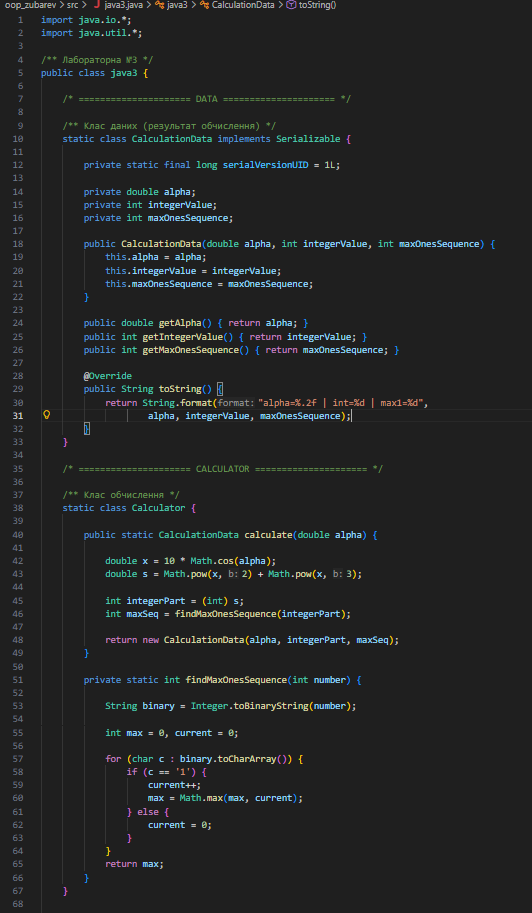
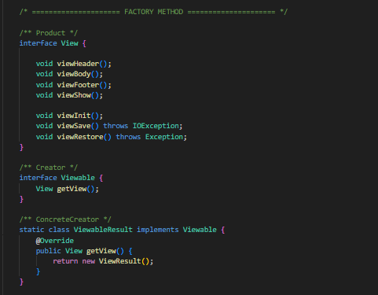
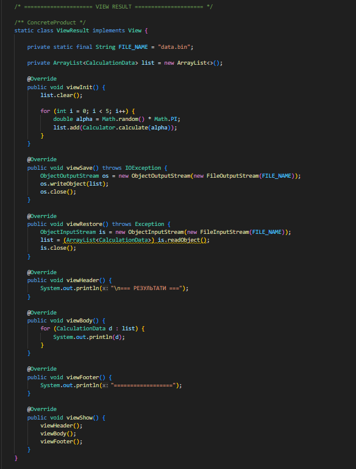
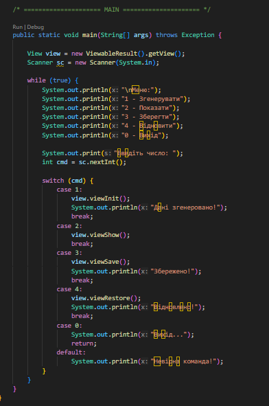
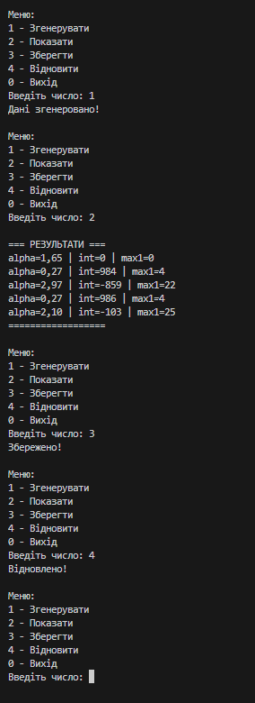

# Завдання 3

## Вам потрібно виконати наступне: 
- Як основа використовувати вихідний текст проекту попередньої лабораторної роботи. Забезпечити розміщення результатів обчислень уколекції з можливістю збереження/відновлення.
- Використовуючи шаблон проектування Factory Method (Virtual Constructor), розробити ієрархію, що передбачає розширення рахунок додавання
нових відображуваних класів.
- Розширити ієрархію інтерфейсом "фабрикованих" об'єктів, що представляє набір методів для відображення результатів обчислень.
- Реалізувати ці методи виведення результатів у текстовому вигляді.
- Розробити тареалізувати інтерфейс для "фабрикуючого" методу.
- Виконати індивідуальне завдання згідно номеру в списку: 
- ***6. Визначити найбільшу довжину послідовності 1 в подвійному поданні
цілісної суми квадрата і куба 10 cos(α).***

## Результат: 

## Код мого завдання: 

[Код](../src/java3.java)