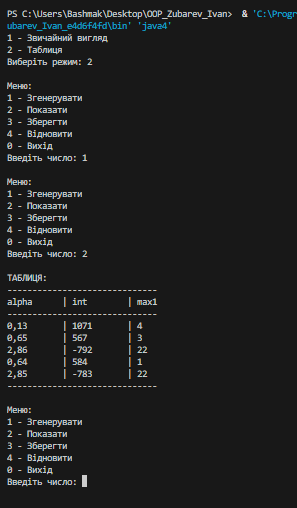
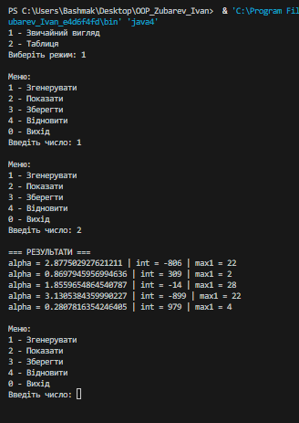

# Завдання 2

## Вам потрібно виконати наступне: 
- За основу використовувати вихідний текст проекту попередньої лабораторної роботи Використовуючи шаблон проектування Factory Method
(Virtual Constructor), розширити ієрархію похідними класами, реалізують методи для подання результатів у вигляді текстової
таблиці. Параметри відображення таблиці мають визначатися користувачем.
- Продемонструвати заміщення (перевизначення, overriding), поєднання (перевантаження, overloading), динамічне призначення методів
(Пізнє зв'язування, поліморфізм, dynamic method dispatch).
- Забезпечити діалоговий інтерфейс із користувачем.
- Розробити клас для тестування основної функціональності.
- Використати коментарі для автоматичної генерації документації засобами javadoc.
- ***Виконати індивідуальне завдання згідно номеру в списку:***
- ***6. Визначити найбільшу довжину послідовності 1 в подвійному поданні
цілісної суми квадрата і куба 10 cos(α).***

## Результат: 

## Код мого завдання: 
[Код](../src/java4.java)