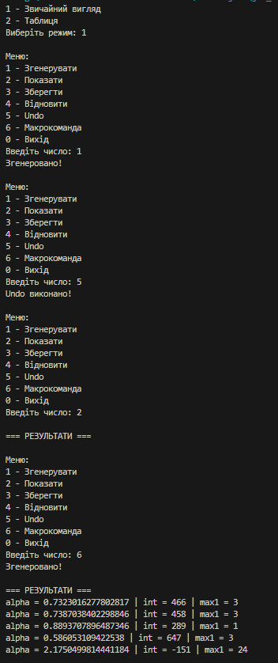

# Завдання 5

## Вам потрібно виконати наступне: 
- Реалізувати можливість скасування (undo) операцій (команд).
- Продемонструвати поняття "макрокоманда"
- При розробці програми використовувати шаблон Singletone.
- Забезпечити діалоговий інтерфейс із користувачем.
- Розробити клас для тестування функціональності програми.
- ***Виконати індивідуальне завдання згідно номеру в списку:***
- ***6. Визначити найбільшу довжину послідовності 1 в подвійному поданні
цілісної суми квадрата і куба 10 cos(α).***

## Результат: 

## Код мого завдання: 
- [Код](../src/java5.java)