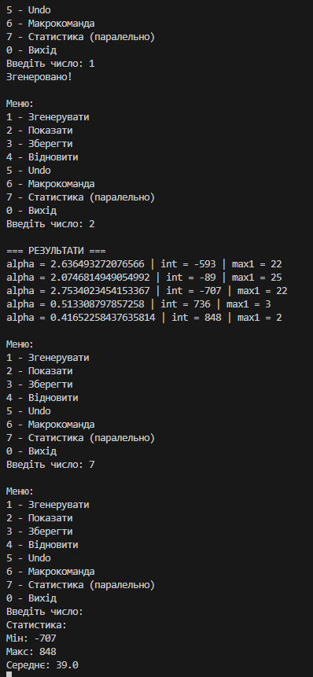

# Завдання 6

## Вам потрібно виконати наступне: 
- Продемонструвати можливість паралельної обробки елементів колекції (пошук мінімуму, максимуму, обчислення середнього значення, відбір за критерієм, статистична обробка тощо).
- Управління чергою завдань (команд) реалізувати за допомогою шаблону Worker Thread.
- ***Виконати індивідуальне завдання згідно номеру в списку:***
- ***6. Визначити найбільшу довжину послідовності 1 в подвійному поданні
цілісної суми квадрата і куба 10 cos(α).***

## Результат: 

## Код мого завдання: 
- [Код](../src/java6.java)